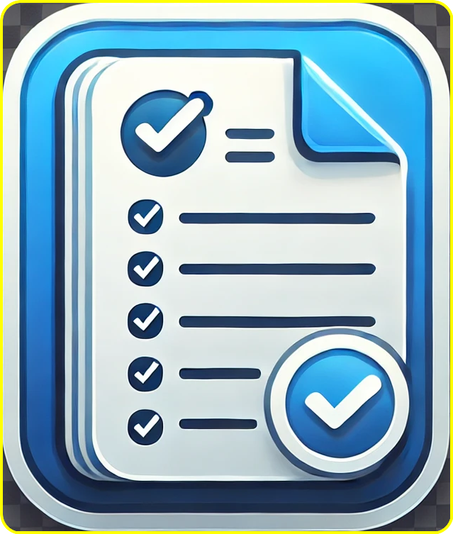

# Mini Clipboard Manager

A simple Chrome extension to save up to 10 items (text, images, URLs) and easily access them. View your saved items with timestamps, and quickly copy or delete them.

## ✨ Features

*   **Save Various Content Types:**
    *   Right-click selected text to save.
    *   Right-click on a webpage to save its URL.
    *   Right-click on an image to save its URL.
    *   Automatically saves text you copy (Ctrl+C or Cmd+C) on any webpage.
*   **Efficient Management:**
    *   Stores the 10 most recent items. Older items are automatically removed.
    *   Displays items in a clean, user-friendly popup.
    *   Each item shows its content and the date/time it was saved.
*   **Easy Access & Actions:**
    *   **Copy:** Click the "Copy" button next to an item to copy its content to your clipboard.
    *   **Delete:** Click the "Delete" button to remove an item from the list.
    *   **Copy All:** A dedicated button to copy all currently saved items at once, separated by newlines.
    *   **Open URLs:** Saved URLs are clickable and open in a new tab.
    *   **View Images:** Saved image URLs are displayed as images in the popup.
*   **User-Friendly Interface:**
    *   Collapsible instructions panel within the popup to guide new users.
    *   Clear visual distinction for different content types.

## 🚀 How to Use

1.  **Saving Items:**
    *   **Context Menu:** Right-click on any selected text, a webpage, or an image. Choose the "Save ... to Clipboard Manager" option from the context menu.
    *   **Automatic Copy:** Simply copy text (Ctrl+C or Cmd+C) from any webpage, and it will be automatically added to the Clipboard Manager.
2.  **Accessing Saved Items:**
    *   Click the Mini Clipboard Manager extension icon in your Chrome toolbar.
    *   The popup will display your 10 most recently saved items.
3.  **Managing Items:**
    *   **View:** Scroll through the list to see your items.
    *   **Copy:** Click the "Copy" button for an individual item.
    *   **Copy All:** Click the "Copy All Items" button at the top of the list.
    *   **Delete:** Click the "Delete" button for an individual item.
    *   **Instructions:** Click the "?" icon in the header to toggle the display of usage instructions.

## 🛠️ Installation (For Developers/Testing)

1.  Download or clone this repository to your local machine.
2.  Open Google Chrome and navigate to `chrome://extensions`.
3.  Enable "Developer mode" using the toggle switch in the top-right corner.
4.  Click the "Load unpacked" button.
5.  Select the directory where you saved the extension files (the `saveit` folder).
6.  The Mini Clipboard Manager extension should now be installed and active! You'll see its icon in the Chrome toolbar.

## 📁 Project Files

*   `manifest.json`: The core file that defines the extension's properties, permissions, background scripts, content scripts, and popup UI.
*   `background.js`: Handles the creation of context menu items and the logic for saving items to `chrome.storage.local`. It ensures only the `MAX_ITEMS` (10) most recent items are kept.
*   `popup.html`: The HTML structure for the extension's popup window that displays saved items.
*   `popup.js`: Contains the JavaScript logic for the popup. It loads items from storage, renders them, and handles user interactions like copying, deleting items, and toggling instructions.
*   `popup.css`: Provides the styling for the `popup.html` interface, ensuring a clean and user-friendly look.
*   `content.js`: A content script injected into web pages. It listens for `copy` events and sends the copied text to `background.js` to be saved.
*   `icons/Clipboard.png`: The icon used for the extension, displayed in the Chrome toolbar and extensions page.

## 💻 Technologies Used

*   HTML
*   CSS
*   JavaScript
*   Chrome Extension APIs:
    *   `chrome.runtime` (for messaging and `onInstalled` events)
    *   `chrome.contextMenus` (for creating right-click menu options)
    *   `chrome.storage.local` (for persisting saved items)
    *   `navigator.clipboard` (for copying text to the system clipboard)

---

Enjoy using the Mini Clipboard Manager!